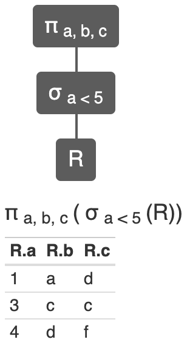

Database Management by Nick Youngson CC BY-SA 3.0 Alpha Stock Images

# Intro

This semester (2019) I had a cahnce to teach `Database Management System` course to second year undergraduate students. We had a fun teaching and learning this course.
Practically, we focussed more on [SQL](https://en.wikipedia.org/wiki/SQL) and [Relational Algebra](https://en.wikipedia.org/wiki/Relational_algebra).

This reposirtory documents some practical details about the course.

## SQL

To practice `SQL`, we used Oracle DBMS.
 is the palteform we used for practical tasks.

The choice of the _fiddle_ based palteform was motivated by following reasons.

1. Since at the learning level the databases involved are often small scale with short quries, the fiddles are most suiteable for these scenarios. Furthermore, dbfiddle saves students from the hastle of `DBMS` installation etc.

2. As the dbfiddle is containerised and running it starts a fresh container, there is no previous data available hence to even run a simple select qurery it requires first to create the table structure and inserting some rows before a select can fetech some data. Thus both strcutral parts `DDL` and manipulation parts `DML` need to be present in the fiddle. This is helpful for learning database manipulation, since students can see the structure of the database.

3. The very purpose of the dbfiddle is also help learners by providing a plateform that they can use in understanding the quries and asking the questions about the queries by _embedding_ the queries in Q/A sites.

4. Lastly, using dbfiddle also helped in collecting assignements from the students online. See [Assignements](#Assignements) section bellow.

## Relational Algebra

To practice `Relational Algebra`, we used the nice online tool [RelaX - relational algebra calculator](https://dbis-uibk.github.io/relax/). The _Relax_ comes with a rich set of features. It visualizes in the form a tree how the relational algebra operations are performed. More importntly it can also convert `SQL` queries into `Relational Algebra`.

Here's an example screenshot for a selection operation embeded in a projection operation.

---

# Assignements

I adopted the online process of assigning and collecting the assignemnets and autoamted it considerably.

For assigning the and collecting the tasks, I used [Google Forms](https://www.google.com/forms/about/). More specifically I asked the students to use the [fiddle](https://dbfiddle.uk/?rdbms=oracle_11.2&fiddle=2136392f0a34ad6b03642cbfc84fe40b) as a tempate and complete the assigned tasks (write the quries) and submit them (the links to their fiddles) via `Google Form`. Meanwhile they could also see what they (and their colleauges) are submitting via **this repository**. The whole purpose of this was activity based learning.

I wrote some scripts ([Bash](https://www.gnu.org/software/bash/) and [PhantomJS](https://phantomjs.org/)) for myslef to collect the responses and preapre this repositoy.
The section bellow (and the submissions direcotry) were created by those scripts.

## Submissions

-   [csc-11.md](/submissions/csc-11.md)
-   [csc-12.md](/submissions/csc-12.md)
-   [csc-7.md](/submissions/csc-7.md)
-   [csm-1.md](/submissions/csm-1.md)
-   [csm-100.md](/submissions/csm-100.md)
-   [csm-101.md](/submissions/csm-101.md)
-   [csm-103.md](/submissions/csm-103.md)
-   [csm-104.md](/submissions/csm-104.md)
-   [csm-106.md](/submissions/csm-106.md)
-   [csm-107.md](/submissions/csm-107.md)
-   [csm-11.md](/submissions/csm-11.md)
-   [csm-110.md](/submissions/csm-110.md)
-   [csm-111.md](/submissions/csm-111.md)
-   [csm-112.md](/submissions/csm-112.md)
-   [csm-114.md](/submissions/csm-114.md)
-   [csm-115.md](/submissions/csm-115.md)
-   [csm-116.md](/submissions/csm-116.md)
-   [csm-117.md](/submissions/csm-117.md)
-   [csm-118.md](/submissions/csm-118.md)
-   [csm-119.md](/submissions/csm-119.md)
-   [csm-120.md](/submissions/csm-120.md)
-   [csm-121.md](/submissions/csm-121.md)
-   [csm-13.md](/submissions/csm-13.md)
-   [csm-14.md](/submissions/csm-14.md)
-   [csm-17.md](/submissions/csm-17.md)
-   [csm-18.md](/submissions/csm-18.md)
-   [csm-19.md](/submissions/csm-19.md)
-   [csm-20.md](/submissions/csm-20.md)
-   [csm-21.md](/submissions/csm-21.md)
-   [csm-22.md](/submissions/csm-22.md)
-   [csm-24.md](/submissions/csm-24.md)
-   [csm-25.md](/submissions/csm-25.md)
-   [csm-28.md](/submissions/csm-28.md)
-   [csm-29.md](/submissions/csm-29.md)
-   [csm-30.md](/submissions/csm-30.md)
-   [csm-31.md](/submissions/csm-31.md)
-   [csm-32.md](/submissions/csm-32.md)
-   [csm-33.md](/submissions/csm-33.md)
-   [csm-34.md](/submissions/csm-34.md)
-   [csm-38.md](/submissions/csm-38.md)
-   [csm-39.md](/submissions/csm-39.md)
-   [csm-4.md](/submissions/csm-4.md)
-   [csm-40.md](/submissions/csm-40.md)
-   [csm-41.md](/submissions/csm-41.md)
-   [csm-42.md](/submissions/csm-42.md)
-   [csm-46.md](/submissions/csm-46.md)
-   [csm-48.md](/submissions/csm-48.md)
-   [csm-49.md](/submissions/csm-49.md)
-   [csm-50.md](/submissions/csm-50.md)
-   [csm-51.md](/submissions/csm-51.md)
-   [csm-52.md](/submissions/csm-52.md)
-   [csm-53.md](/submissions/csm-53.md)
-   [csm-55.md](/submissions/csm-55.md)
-   [csm-58.md](/submissions/csm-58.md)
-   [csm-59.md](/submissions/csm-59.md)
-   [csm-60.md](/submissions/csm-60.md)
-   [csm-61.md](/submissions/csm-61.md)
-   [csm-62.md](/submissions/csm-62.md)
-   [csm-64.md](/submissions/csm-64.md)
-   [csm-67.md](/submissions/csm-67.md)
-   [csm-68.md](/submissions/csm-68.md)
-   [csm-7.md](/submissions/csm-7.md)
-   [csm-71.md](/submissions/csm-71.md)
-   [csm-72.md](/submissions/csm-72.md)
-   [csm-74.md](/submissions/csm-74.md)
-   [csm-76.md](/submissions/csm-76.md)
-   [csm-78.md](/submissions/csm-78.md)
-   [csm-8.md](/submissions/csm-8.md)
-   [csm-80.md](/submissions/csm-80.md)
-   [csm-81.md](/submissions/csm-81.md)
-   [csm-82.md](/submissions/csm-82.md)
-   [csm-83.md](/submissions/csm-83.md)
-   [csm-84.md](/submissions/csm-84.md)
-   [csm-85.md](/submissions/csm-85.md)
-   [csm-86.md](/submissions/csm-86.md)
-   [csm-87.md](/submissions/csm-87.md)
-   [csm-88.md](/submissions/csm-88.md)
-   [csm-89.md](/submissions/csm-89.md)
-   [csm-90.md](/submissions/csm-90.md)
-   [csm-94.md](/submissions/csm-94.md)
-   [csm-95.md](/submissions/csm-95.md)
-   [csm-96.md](/submissions/csm-96.md)
-   [csm-98.md](/submissions/csm-98.md)

### Top 5 contributors

| Seat    | # Commits |
| ------- | --------- |
| csm-71  | 9         |
| csm-87  | 8         |
| csm-28  | 8         |
| csm-18  | 8         |
| csm-101 | 8         |
| csm-95  | 7         |
| csm-85  | 7         |
| csm-40  | 7         |
| csm-39  | 7         |
| csm-33  | 7         |
